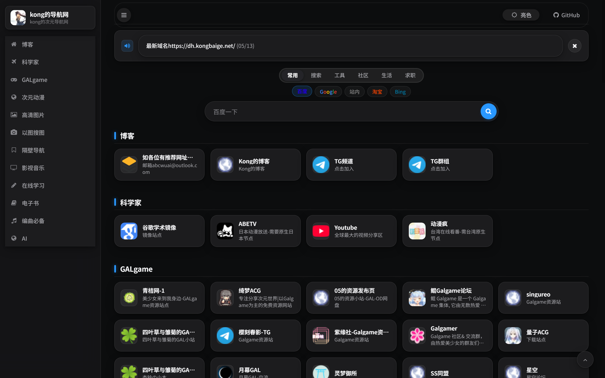
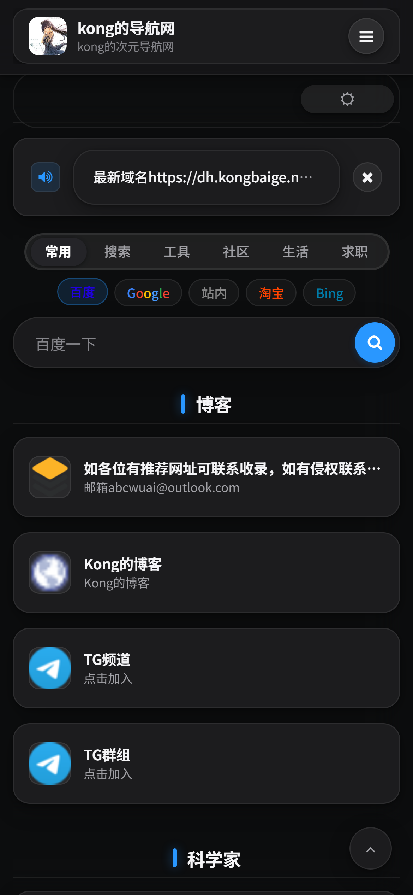
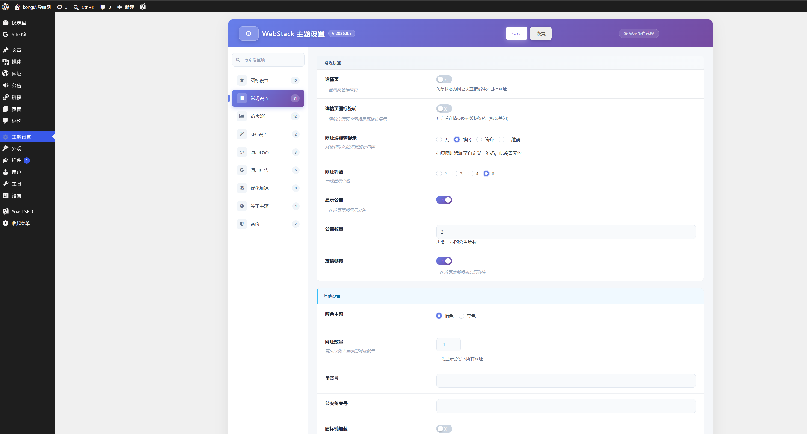

# WebStack-2026.10.7 (Apple Design Edition)

基于 [owen0o0/WebStack](https://github.com/owen0o0/WebStack) 深度定制二开的 WordPress 导航主题。全面采用 **Apple Design System** 设计语言，配备 Spotlight 居中聚合搜索、macOS 智能 Dock 侧边栏与原生暗色模式；内置**全量网址后台一键并行测活**、**自研轻量级实时访客与在线人数统计**，并完成了深度的移动端重构与安全加固。

- 🌐 **演示站点**：[https://dh.kongbaige.net](https://dh.kongbaige.net)
- 📦 **版本发布**：[GitHub Releases](https://github.com/kongbai9420/WordPress-WebStack/releases)
- 🇺🇸 **English Documentation**: [README_EN.md](README_EN.md)

---

### 📸 界面预览

#### 1. 🖥️ 电脑端前台（Desktop View）


#### 2. 📱 手机端前台（Mobile View）
<p align="left">
  
</p>

#### 3. ⚙️ 后台主题设置面板（Admin Settings）


---

### ✨ 新增核心功能深度解析

#### 1. 🔍 后台「网址」一键并行测活系统（Site Health Monitor）
- **高并发并行探测**：使用 `curl_multi` 实现高效异步网络探测，支持在主题后台自由配置并发线程数（1~50，默认 20）。海量网址库无需长时间阻塞，数秒即可批量检测。
- **智能兼容与防误判**：
  - 自动识别 CDN 与防爬保护机制（403 Forbidden、429 Too Many Requests、503 Service Unavailable 均智能识别为存活，避免误伤接入 Cloudflare / 盾防的站点）。
  - 支持配置测活 HTTP/SOCKS5 代理，防止服务器因目标站点地域屏蔽造成误报。
  - 网络层故障可自动标记为“未知/未检测”，避免直接将临时断网的站点误删。
- **状态徽章与过滤清理**：
  - 在 WordPress 后台「网址」列表中直观展示状态徽章（正常 / 异常 / 未知），悬浮可查看具体 HTTP 状态码与耗时。
  - 支持按存活状态下拉筛选；支持一键勾选失效、一键移入回收站批量删除（支持恢复，数据安全可控）。

#### 2. 📊 独立访客与实时在线统计引擎（Live Traffic Engine）
- **实时访客心跳机制**：无需依赖重型外部统计平台，内置轻量自建数据表，实时记录在线人数、今日独立访客（UV）、今日页面浏览（PV）及全站累计访问量。
- **隐私保护与防刷限流**：
  - 不落地存储明文 IP，全流程加盐哈希脱敏，符合隐私合规。
  - 内置短时间防刷新限流（默认 30 秒内重复访问不重复计入 PV），支持心跳防刷限频。
- **Apple 风格状态胶囊**：前台底部集成精致的脉冲微光绿点在线指示器，数据自适应排版。

#### 3. 🎨 Apple Design System 视觉与交互全量重构
- **毛玻璃与 Aurora 极光氛围灯**：系统级 `backdrop-filter: blur` 磨砂微质感，支持硬件加速的流体 Aurora 氛围灯，自适应 `prefers-reduced-motion` 减弱动效偏好。
- **Spotlight 极简居中搜索**：仿 macOS Spotlight 搜索胶囊，分段式引擎切换，去除繁杂冗余选项，移动端丝滑弹出。
- **macOS 智能 Dock 侧边栏**：240px 展开与 68px 精简 Dock 自由切换，`localStorage` 记忆用户习惯，折叠开关统一收纳于顶部栏。
- **克制美学与纯净暗色模式**：分类标题采用克制药丸指示器，卡片配备 40px Squircle 连续圆角图标与层级投影；暗色模式完美适配 OLED 屏幕，无刺眼冲突色。

#### 4. 📱 移动端全链路深度调优与修复
- **告别首屏白屏**：彻底剔除阻碍国内网络首屏加载的 Google WebFonts，全面回退至 iOS/macOS/Windows 系统级极速字体栈。
- **独立顶栏胶囊**：重构移动端顶栏为 52px 悬浮磨砂胶囊，右侧药丸形汉堡按钮，解决旧版菜单按钮挤出屏幕的 Bug。
- **视口遮罩彻底解决**：彻底修复旧版主题在手机端因为 `fixed` 结合上下拉伸导致的 100vh 隐藏磨砂层覆盖卡片无法点击的顽疾。
- **自适应底部版权栏**：修正移动端负边距导致的横向偏移错位，访客统计组件与荣誉徽章单行居中对齐，排版整洁。

#### 5. 🛡️ 架构可靠性与安全防护
- **主题设置面板（CS Framework）升级**：顶部渐变导航栏智能吸顶，解决向下滚动时变白的问题；左侧分组菜单支持粘性锁定（Sticky），长页面切换无需反复翻滚。
- **filemtime 智能防缓存**：核心样式自动绑定文件修改时间戳，主题更新后访客浏览器即刻拉取最新资产，彻底无需手动清理缓存。
- **安全加固**：全面加固所有 AJAX 请求与表单提交，修复任意文件上传风险，标配 Nonce CSRF 防护。

---

### 🖥️ 推荐运行环境

- **WordPress**：6.0 及以上（推荐最新稳定版）
- **PHP**：7.4 / 8.0 / 8.1 / 8.2（需开启 `curl` 扩展以支持一键测活）
- **数据库**：MySQL 5.7 / 8.0 或 MariaDB 10.4+
- **Web 服务器**：Nginx（推荐）或 Apache

---

### 🚀 安装与部署

1. **获取主题**：前往 [Releases 页面](https://github.com/kongbai9420/WordPress-WebStack/releases) 下载最新发行版 `WebStack-*.zip`。
2. **安装启用**：WordPress 后台「外观」→「主题」→「上传主题」，选择 zip 包安装并激活。
3. **固定链接刷新**：若点击分类出现 404，请前往 WordPress 后台「设置」→「固定链接」，点击一次「保存更改」。
4. **Nginx 伪静态配置**（推荐）：
   ```nginx
   location / {
       try_files $uri $uri/ /index.php?$args;
   }
   rewrite /wp-admin$ $scheme://$host$uri/ permanent;
   ```

---

### 💡 鸣谢与版权

- 前端设计原型：[Viggo (WebStackPage)](https://github.com/WebStackPage/WebStackPage.github.io)
- WordPress 主题底层框架：[iowen (一为忆)](https://github.com/owen0o0/WebStack)
- 现代化与 Apple 风格重构：[kongbai9420](https://github.com/kongbai9420/WordPress-WebStack)
- 开源协议：GPL-3.0 License，使用或二开时请保留页脚作者版权链接。
